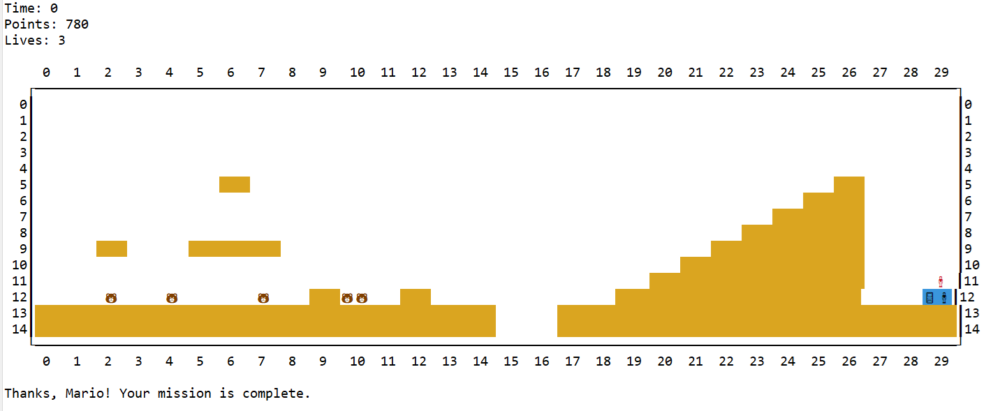

# Preguntas Frecuentes

## Práctica 1

### Al resetear el juego, ¿qué mapa debe aparecer?

El reset deberá resetear el mapa en *ejecución*. Por defecto el mapa en ejecución es el que hemos llamado 1, pero ten en cuenta que el mapa en ejecución se puede cambiar a través de los argumentos del programa. Por lo que si se ha iniciado con el mapa 0 el programa al resetear deberá mostrar el mapa 0.

Como el comando permite recibir un argumento entero con el número del mapa, si este es correcto se debería cargar el plano correspondiente a ese mapa y en caso contrario se indicaría con un mensaje de error. De esta forma se puede utilizar tanto el reset simple: `reset`, como el con nivel: `reset numMap`.

### La salida por consola muestra caracteres extraños, ¿qué ocurre?

Lo más probable es que la codificación que esté usando Eclipse no sea UTF-8. Para cambiarla:
- Selecciona el proyecto y pulsa el botón derecho seleccionando la opción *Properties*. 
- Elige el menú *Resource* y  comprueba que el valor de *Text File Encoding* es *UTF-8*. 
- En caso contrario, selecciona dicha opción.

### ¿Puedo llevar las posiciones separadas en dos valores: (columna, fila) o (fila, columna)?

No, se os ha pedido expresamente que creéis una clase para manejar las posiciones `Position` y además que sea **inmutable**. El único método de la práctica que recibe las posiciones en **dos valores enteros** es el método `Game.positionToString(int col, int row)`.

Si lo piensas como matriz el acceso estándar suele ser `(fila, columna)` y a futuro cuando nos refiramos a una posición del tablero desde la vista lo haremos a través de su fila y columna (en esta práctica no lo utilizamos). Pero, si lo piensas como puntos en el plano coordenadas `(x, y)` la `x` corresponde a las columnas y la `y` a las filas. Decide una representación interna en el *modelo* y mantenla a lo largo del proyecto. 

### ¿En una misma posición puede haber varios objetos?

Sí, en una misma posición pueden cohexistir varios objetos. En concreto podría haber vario Goombas. Por lo que deberás mostrarlos todos.

Ej. En la fila 12, columna 10 se encuentran dos Goombas y en la fila 12 columna 29 se encuentra Mario junto con la puerta de salida.

### ¿Se borran los Goombas cuando mueren?

Sí, la semántica actual de estar vivo es equivalente a encontrarse en el tablero. Por lo que tanto al colisionar con Mario como al salirse del tablero deberá desaparecer del `GameObjectContainer`. Así que el `GameObjectContainer` es el responsable de borrar los objetos que no se encuentren vivos. Piensa cuales de sus métodos deben ser **públicos** y cuales **privados**.
