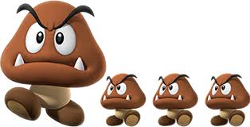

# Práctica 1: Mario Bros (versión simplificada)

**Entrega**: **Semana del 13 de octubre**. 

**Objetivos**: Introducirse en **Java** y la **programación orientada a objetos**, trabajar con **arrays**, **enumerados** y **cadenas** (`String`), manejar entrada y salida por consola.

**Preguntas Frecuentes**: Como es habitual (y normal) que tengáis dudas, las iremos recopilando en este [documento de preguntas frecuentes](../faq.md). Para saber los últimos cambios que se han introducido [puedes consultar la historia del documento](https://github.com/informaticaucm-TPI/2526_MarioBros/commits/main/enunciados/faq.md). 

# Índice

<!-- TOC start -->
* [Control de copias](#control-de-copias)
* [1. Descripción de la práctica](#1-descripción-de-la-práctica)
  - [Introducción](#introducción)
  - [Detalles de la práctica](#detalles-de-la-práctica)
* [2. Estructura del proyecto](#2-estructura-del-proyecto)
* [3. Desarrollo por hitos](#3-desarrollo-por-hitos)
  - [A. Pintar el tablero](#a-pintar-el-tablero)
  - [B. Ciclo de juego básico](#b-ciclo-de-juego-básico)
  - [C. Movimiento automático y acciones de usuario](#c-movimiento-automático-y-acciones-de-usuario)
  - [D. Acciones de Mario](#d-acciones-de-mario)
  - [E. Colisiones Mario ↔ ExitDoor](#e-colisiones-mario-exitdoor)
  - [F. Colisiones Mario ↔ Goombas](#f-colisiones-mario-goombas)
* [4. Entrega](#4-entrega)
* [5. Pruebas](#5-pruebas)
  - [Automatización de las pruebas: JUnit](#pruebas-JUnit)
<!-- TOC end -->


<!-- TOC --><a name="control-de-copias"></a>
## Control de copias

Durante el curso se realizará control de copias de todas las prácticas, comparando las entregas de todos los grupos de TPI. Se considera copia la reproducción total o parcial de código de otros alumnos o cualquier código extraído de Internet o de cualquier otra fuente, salvo aquellas autorizadas explícitamente por el profesor. 


<!-- TOC --><a name="1-descripción-de-la-práctica"></a>
## 1. Descripción de la práctica

<!-- TOC --><a name="11-introducción"></a>
### Introducción
Super Mario es una saga de videojuegos clásica, lanzada a comienzos de la década de los ochenta, que tuvo una gran influencia en el desarrollo de los juegos de plataformas. El juego consiste en controlar a Mario, un fontanero italiano, mientras recorre distintos mundos, evita enemigos y obstáculos, y rescata a la princesa Peach del villano Bowser.  

En nuestra práctica, vamos a implementar una versión simplificada de **Mario Bros** donde Mario se mueve en un tablero 2D, se encuentra con enemigos, puede morir, ganar puntos y alcanzar una puerta de salida, objetivo final. En nuestra versión, el juego se desarrollará por turnos, en los que el usuario podrá realizar una acción (ejecutar un comando). Por tanto, el juego se quedará parado hasta que el jugador realice la acción. Seguidamente, los objetos del juego que así lo requieran tendrán que actualizarse para realizar sus movimientos o acciones correspondientes. 


Si no has jugado, o no conoces el juego, te recomendamos que lo pruebes antes de desarrollar la práctica. Existen varias versiones gratuitas en la web, una de ellas es accesible a través del enlace: https://supermarioplay.com/. 

A lo largo del cuatrimestre iremos desarrollando nuestra versión del juego. Empezaremos por esta versión reducida de la misma, donde Mario solo camina y realiza algunas acciones, y solo existe un tipo de enemigo, el Goomba. 




En la práctica 2, mejoraremos el código añadiendo más funcionalidad a Mario, así como añadiendo otros objetos diferentes y más comandos, todo esto haciendo uso de las capacidades que nos da la programación orientada a objetos. 

<!-- TOC --><a name="12-detalles-sobre-la-práctica"></a>
### Detalles de la práctica. 

En esta primera práctica consideraremos un tablero de **15 x 30** casillas. Este valor tendrá que depender de constantes, esto es, el tablero tendrá que cambiar de tamaño con el cambio de estas constantes. Tanto las filas como las columnas serán identificadas con números (del 0 a su tamaño menos 1). Por tanto, la casilla de arriba a la izquierda será (0,0), la de arriba a la derecha (0,29), la de abajo a la izquierda (14,0) y la de abajo a la derecha, (14,29). 

En nuestra práctica habrá cuatro objetos: **Mario**, **Goomba**, **Land** y **ExitDoor**. Sus comportamientos serán descritos en la tercera sección de este enunciado. Por otra parte, en cada ciclo de juego se realizará siempre la siguiente secuencia:

1. ***Draw.*** Se pinta el tablero y se muestra la información del juego.

2. ***User command.*** El usuario puede actualizar el juego o ejecutar un comando que no actualiza el juego, como solicitar el listado de comandos disponibles o salir del juego.

3. ***Update***. Dependiendo del comando introducido el juego se actualiza, es decir, todos los objetos del juego del tablero se actualizan.

Esto también será explicado en la sección 3 de este enunciado. 

<!-- TOC --><a name="#2-estructura-del-proyecto"></a>
## 2. Estructura del proyecto
Se os entrega una plantilla con los siguientes paquetes y clases:


+ `tp1`
    - _`Main`_
+ `tp1.view`
	- _`ConsoleColorsAnsiCodes`_
	- _`ConsoleColorsView`_
	- _`ConsoleView`_
	- _`ViewInterface`_
	- _`GameView`_
	- `Messages`
+ `tp1.control`
    - `Controller`
+ `tp1.utils`
    - _`MyStringUtils`_
+ `tp1.logic`
    - `GameObjectContainer`
	- `Action`
	- `Position`
	- `Game`
+ `tp1.logic.gameobjects`
    - `Mario`


Como verás, dentro de cada paquete hay varios ficheros. Los ficheros en cursiva se encuentran completamente implementados y no debes cambiar su código. El resto, en cambio, están parcialmente implementados y puedes (y debes) añadir más métodos y atributos a sus clases. Además, también puedes crear más clases y paquetes si lo consideras necesario.

El código entregado sigue algo parecido al patrón _Modelo-Vista-Controlador_ (MVC). 

+ La **Vista** se corresponde con el paquete `view`. Ahí se encuentran las clases encargadas de mostrar el juego. En nuestro caso, se trata de una simple vista por consola. Se encarga de ello `GameView`, que recibe una instancia de `Game` y se encarga de mostrar el estado del juego en consola. Se puede observar que existen dos vistas `ConsoleView` y `ConsoleColorsView` la primera sin colores y la segunda con colores. Para conseguir la vista sin colores es necesario añadir al programa un segundo parámetro `NO_COLORS`. 

+ El **Controlador** se corresponde con el paquete `control`. Ahí se encuentra la clase encargada de gestionar el "ciclo de vida" del juego: mientras que el juego no se acaba, solicita órdenes al usuario, las traslada al juego y llama a la vista. Estamos ante un controlador sencillo, que se limita a leer las órdenes que el usuario teclea por consola, en lugar de capturar pulsaciones de teclas u otras alternativas. Aquí es donde se implementa el ciclo de vida del juego, sin entrar en la lógica del juego.

+ El **Modelo** se corresponde con el paquete `logic`, donde se encuentra la lógica del juego, es decir, las reglas del juego y el manejo de todos los objetos del juego. La clase principal de este paquete es `Game`. Para poder realizar su tarea, el juego recibe del controlador la orden correspondiente. Entre los comandos del juego hay órdenes para resetearlo (`reset`) o para pasar un ciclo (`update`). Como puedes observar, en el modelo se implementa todo lo relativo al juego: tiempo restante, vidas de Mario, si se ha terminado, si ha ganado Mario, etc.

Una vez vista la estructura de la práctica, nos damos cuenta de que hay mucho trabajo por delante y nos planteamos...


<!-- TOC --><a name="3-desarrollo-por-hitos"></a>
## 3. Desarrollo por hitos

### Introducción
En esta sección se os irá indicando de forma estructurada qué pasos seguir de cara a completar la práctica. Esto os ayudará como guía práctica para planificar tareas, detectar y corregir errores a tiempo, y asegurar que cada paso se entiende y valida antes de pasar al siguiente. Para ello, lógicamente, es clave que vayáis paso a paso y que hasta que un paso no esté completo no os pongáis con el siguiente. Además de qué hacer, se os informará sobre la función de ciertas clases, métodos o atributos importantes. 

<!-- TOC --><a name="a-pintar-el-tablero"></a>
### [A] Pintar el tablero

Una vez hemos recibido las instrucciones anteriores y la plantilla, el primer reto que tenemos que llevar a cabo es el de lograr mostrar la información del juego y el tablero por consola. Para ello, hemos de entender que es la clase ``Controller``, a través del método ``public void run()``, la que se encarga de controlar el bucle principal del juego. Esto es, dibujar por consola, pedir un comando al usuario y actualizar el juego. Se puede observar, además, que esta clase requiere de dos atributos:

  ```java
  private Game game;
  private GameView view;
  ```

Por ahora, nos centramos en mostrar por consola. Para ello también debemos conocer el método ``showGame()`` de la clase ``GameView``, que es llamado en el método ``run``. Por tanto, el primer sub-objetivo debe ser conseguir que este método funcione correctamente y lograr dibujar un tablero vacío sin dar error. 

Posteriormente, debemos mostrar antes del tablero los valores de tres variables de ``Game``:  `time` (empieza en `100` y en cada turno se ha de reducir en `1`), `points` (empieza en `0` y su valor se irá modificando a lo largo del juego) y `lives` (son las vidas de `Mario`, comienza en `3` y cada vez que muera, perderá una vida, cuando el valor de `lives` sea `0`, acabará la ejecución del programa con el mensaje *Player loses!*). 

A continuación vamos a introducir los primeros objetos al tablero. Para ello, podemos por ejemplo crear en primera lugar una clase ``Land`` que represente a la tierra, el objeto más sencillo. Este objeto es sólido, esto es, no puede compartir posición con ningún otro, y será representado con el icono **▓**. Deberá contar con, entre otros, este atributo: 
  ```java
  private Position pos;
  ```
  
 además, el método que devolverá el icono que representa la tierra debe ser:
   ```java
  public String getIcon();
  ```
  
Una vez que hayamos creado la clase ``Land``, procederemos a añadir objetos de ese tipo al juego. Esto lo haremos desde la clase ``GameObjectContainer``. Esta clase se encargará de gestionar los diferentes objetos del juego. Tendremos pues que crear un array de ``Land`` (incompletos, esto es, suficientemente grandes y con un contador). Además, esta clase tendrá un método para añadir ``Land`` al juego: 
   ```java
  public void add(Land land);
  ```
 
 Bien, una vez que hemos conseguido crear objetos de tipo ``Land``, hemos conseguido añadirlos al juego y hemos conseguido que se visualicen en la posición concreta en el tablero, podemos seguir haciendo lo propio con el resto de objetos de forma similar a como hemos hecho con ``Land``:
 
+ Tenemos por un lado la ``ExitDoor``, el icono que la representa es **🚪**. Es un objeto no sólido, solo podrá haber una ``ExitDoor`` en el juego. 
+ Por otro lado tenemos los ``Goombas``. Estos objetos son no sólidos y *movibles* (todo lo referente al movimiento lo veremos más adelante). El icono que los representa es **🐻**. Puede haber más de uno en el juego. 
+ Finalmente, tenemos la clase ``Mario``. Mario es un objeto no sólido, solo podrá haber uno en el juego y puede tener iconos diferentes dependiendo de su estado: Su icono original será **🧍** si camina hacia la derecha y **🚶** si lo hace hacia la izquierda. Además, podrá tener un atributo ``big`` activado o no. Si está activado, el icono de Mario se representará no solo en la casilla en que se encuentra, sino también en la casilla inmediatamente superior (a efectos de lógica, Mario también estará en ambas casillas). 

Finalmente, al igual que para los objetos ``Land``, en ``GameObjectContainer`` existirán unos métodos sobrecargados (esto es, tienen el mismo nombre pero su comportamiento depende del tipo del argumento que reciba) que servirán para añadir los diferentes tipos de objeto al juego:
   ```java
  public void add(Goomba goomba);
  public void add(ExitDoor exit);
  public void add(Mario mario);
  ```

Además de esto y como veremos más adelante, el contenedor será responsable de llevar las peticiones del juego a cada uno de sus objetos.

Se podrán crear varios mapas dependiendo de la distribución de objetos que tengamos, para lo cual utilizaremos métodos como ``private void initLevel0()`` o ``private void initLevel1()``  El mapa elegido dependerá del (primer) argumento por parámetro que le hayamos pasado a la aplicación (ver imagen). 


``initLevel1()`` mostrará el mapa que mostramos a continuación,

``initLevel0()`` mostrará el mismo mapa pero solo con el el Goomba situado en la fila 0 y columna 19. Este mapa es el aconsejado para el proceso de depuración que debeís ir realizando. La posibilidad de crear un Game con el número de nivel permitirá a la larga si se quiere añadir más mapas. 


  
Si has llegado hasta aquí y logras dibujar correctamente el tablero añadiendo objetos en las diferentes posiciones y creando mapas que dependan del argumento de programa, ¡ya has dado el primer paso!  

<!-- TOC --><a name="b-ciclo-de-juego-básico"></a>
### [B] Ciclo de juego básico
Una vez que ya sabemos dibujar el tablero, vamos a empezar con los primeros comandos. Los comandos serán los siguientes:

+ [h]elp: Este comando solicita a la aplicación que muestre la ayuda relativa a cómo utilizar los comandos. Se mostrará una línea por cada comando. Cada línea tiene el nombre del comando seguida por ':' y una breve descripción de lo que hace el comando.
```java
Command > help

Available commands:
   [a]ction [[R]IGHT | [L]EFT | [U]P | [D]OWN | [S]TOP]+: user performs actions
   [u]pdate | "": user does not perform any action
   [r]eset [numLevel]: reset the game to initial configuration if not numLevel else load the numLevel map
   [h]elp: print this help message
   [e]xit: exits the game
```


+ [e]xit:  Este comando permite salir de la aplicación, mostrando previamente el mensaje *Player leaves game*.
+ [r]eset [numLevel]: este comando permitirá el reinicio de la partida, con el nivel indicado en [numLevel]. Si el nivel no existe, deberá mostrar el mapa del nivel actual. 
+ [a]ction [[R]IGHT | [L]EFT | [U]P | [D]OWN | [S]TOP]+: este comando permitirá al usuario realizar una acción. 
+ [u]pdate | "": se actualiza el juego (el usuario no realiza ninguna acción).

La aplicación debe permitir comandos escritos en minúsculas, mayúsculas o mezcla de ambas y la aplicación debe permitir el uso de la primera letra del comando (o la indicada entre corchetes, si esa letra ya se utiliza) en lugar del comando completo. Por otro lado, si el comando está vacío se identifica como ``[u]pdate`` y si el usuario ejecuta un comando que no cambia el estado del juego, o un comando erróneo, el tablero no se debe repintar. Además, si el comando está mal escrito, no existe, o no se puede ejecutar, la aplicación mostrará el siguiente mensaje de error *Error: Unknown command: comandoTecleadoPorElUsuario*.


En primer lugar, implementa el comando ``exit`` y haz que el juego termine cuando se muestre este comando. Posteriormente, realiza el comando ``help``, que muestre este mensaje. Los comandos deberán añadirse en un bucle dentro de la clase ``Controller``.

Posteriormente, tenemos que añadir el comando ``reset[numLeve]``. Se llevará a cabo el reseteo de todo el tablero y del `time`, que también volverá a su valor inicial. No obstante, tanto el total de puntos como el número de vidas se mantienen igual que estaban (no sufren el efecto del comando). 

Los comandos ``[a]ction [[R]IGHT | [L]EFT | [U]P | [D]OWN | [S]TOP]+`` y ``[u]pdate | ""`` se explicarán en las siguientes secciones. 

Por tanto, si has conseguido implementar correctamente los comandos ``exit``, ``help`` y ``reset(numLevel)``, ¡enhorabuena, ya está completado el segundo paso!


---

<!-- TOC --><a name="c-movimiento-automático-y-acciones-de-usuario"></a>
### [C] Movimiento automático y acciones de usuario
#### Movimiento automático y el comando `update`

A continuación, vamos a comenzar a darle movimiento a nuestros objetos, esto es, a implementar el comando **`[u]pdate|""`**.  
Este comando se apoyará en el método `public void update()` que deberá estar definido en las clases de los objetos *movibles*, es decir:  

- `Mario`  
- `Goomba`  

Como iremos viendo:  
- En `Mario.update()` se deberán considerar **tres aspectos**:  
  1. El **movimiento automático**.  
  2. Las posibles **acciones del jugador**.  
  3. Las **colisiones** con otros objetos.  

- En `Goomba.update()` solamente será necesario implementar el **movimiento automático**.  

##### `update()` en **Goomba**

El comportamiento de un *Goomba* es completamente automático:  

- Si se encuentra **sobre un objeto sólido**, avanza un paso por turno en la dirección actual (empieza moviéndose hacia la **izquierda**).  
- Si choca con un objeto sólido o con la pared lateral del tablero, **invierte su dirección**.  
- Si no tiene suelo debajo, **cae una casilla hacia abajo** hasta volver a encontrarse con un objeto sólido.  
- Si sale del tablero por abajo, **muere**.  
- Cuando un Goomba muere, debe ser **eliminado de la lista** de Goombas.  

##### `update()` en **Mario**
 	
El movimiento automático de Mario es muy parecido al de Goomba, pero con algunas diferencias:  

- Mario comienza caminando hacia la **derecha** (no hacia la izquierda).  
- Cuando Mario muere avisa al game de que ha muerto para que haga los ajustes necesarios:
    - Perder **una vida**. Tiene inicialmente **tres vidas**.
    - Resetear la partida. La partida termina cuando se queda sin vida mostrando el mensaje "Game over".  

Además de este movimiento automático, en `Mario.update()` se deberán procesar también:  

- Las **acciones añadidas por el jugador** (almacenadas en la clase `ActionList`).  
- Las **colisiones** con otros objetos del tablero (por ejemplo: Goombas o la puerta de salida).  

Esto se verá en las siguientes secciones del enunciado. 


##### `update()` en **Game**

Para que todo funcione, también será necesario implementar el método `public void update()` en la clase `Game`.  

Este método deberá:  

1. Llamar al método `update()` de la clase `GameObjectContainer`.  
2. El contenedor, a su vez, llamará a los métodos `update()` de los objetos del tablero.  

Es **muy importante** respetar el orden en que se actualizan los objetos, para que las pruebas no os den problemas:  

1. **Primero Mario** (para que sus acciones y colisiones se procesen antes).  
2. **Después los Goombas**.  

De este modo se garantiza un comportamiento coherente en cada ciclo de juego.  

Si ya has conseguido darle movimiento (automático) a ``Mario`` y ``Goomba`` y estos se mueven de manera correcta, puedes avanzar a la siguiente sección. 

---

<!-- TOC --><a name="d-acciones-de-mario"></a>
### [D] Acciones de **``Mario``**

Además del movimiento automático, **Mario** debe responder a las **acciones introducidas por el jugador**.  
Estas acciones se representan mediante el enumerado `Action` y se gestionan a través de la clase auxiliar `ActionList`.

Antes de nada, es importante destacar que al igual que en el caso de los comandos, para las acciones, la aplicación debe permitir comandos de acciones escritos en minúsculas, mayúsculas o mezcla de ambas y la aplicación debe permitir el uso de la primera letra del comando (o la indicada entre corchetes, si esa letra ya se utiliza) en lugar del comando completo. Además, se pueden ejecutar más de una acción en el comando. Por ejemplo:
```java
Command > action up UP rIGhT
```
o
```java
Command > a u u r
```


El flujo es el siguiente:  
1. El controlador (`Controller`) convierte los comandos de texto en objetos `Action`.  
2. Estas acciones se añaden a una lista en la clase ``Mario`` mediante `Game.addAction(Action act)`.  
3. En cada ciclo (`Game.update()`), Mario ejecuta todas las acciones pendientes en **orden de llegada**, pudiendo encadenar varias en un mismo turno, pero respetando ciertas restricciones.  
4. Si Mario no se ha movido tras ejecutar las acciones, se aplica su movimiento automático.

#### Tipos de acciones

Las acciones disponibles están definidas en el enum `Action` y controlan tanto el movimiento de Mario como su icono:

- **LEFT / RIGHT**: Mario cambia su dirección horizontal a la indicada y avanza un paso en esa dirección. Estas acciones actualizan el icono de Mario según la dirección y permiten reemplazar la dirección `STOP` previamente asignada.
- **UP**: Mario asciende una casilla verticalmente. No altera la dirección horizontal ni el icono; solo afecta la posición vertical.
- **DOWN**: Si Mario está en el aire, cae hasta alcanzar un suelo sólido o salir del tablero. Si está en el suelo, se detiene horizontalmente, cambia su dirección a `STOP` y el icono se actualiza a **🧑** (doble si Mario es grande), indicando que está quieto horizontalmente.
- **STOP**: Indica que Mario **no tiene dirección horizontal activa**. Es decir, paraliza a Mario. El icono mostrado es **🧑** (doble si Mario es grande). La dirección `STOP` solo cambia con acciones `LEFT` o `RIGHT`, actualizando el icono correspondiente. Si la acción es `UP`, Mario se mueve verticalmente, pero el icono no cambia. Si la acción es `DOWN` en el suelo, no hay cambios adicionales y el icono permanece **🧑**.


#### Clase `ActionList`

La clase `ActionList` gestiona las acciones que el jugador añade para Mario:  
- Almacena internamente una lista de `Action`.  
- Permite acumular varias acciones para ejecutarlas **secuencialmente** en un mismo ciclo de juego.  
- Aplica restricciones para evitar combinaciones incoherentes. En todos los casos, las acciones adicionales **no generan error**, simplemente se **ignoran**. En concreto:  
  - **LEFT/RIGHT**: si aparecen ambas, se mantiene la primera y la otra se ignora. Se permiten repeticiones de la misma dirección (p.ej. `RIGHT RIGHT` mueve dos pasos a la derecha), pero las combinaciones opuestas respetan la primera ocurrencia y tienen un **máximo de 4 ejecuciones** por turno.  
  - **UP/DOWN**: si aparecen ambas, se mantiene la primera y la otra se ignora. Las acciones verticales (`UP` o `DOWN`) también tienen un **máximo de 4 ejecuciones** por turno; las adicionales se ignoran.

#### Ejecución de acciones en Mario

En cada turno, las acciones del jugador se aplican antes del movimiento automático de Mario. El proceso en `Mario.update()` es:  

1. Las acciones indicadas por el jugador se registran en una lista de acciones pendientes.  
2. Cada acción se ejecuta secuencialmente, modificando la posición o el estado de Mario según corresponda. Esto permite **encadenar varias acciones en un único ciclo**, logrando movimientos más complejos (por ejemplo: `RIGHT UP UP` → Mario avanza y escala dos casillas).  
3. La lista de acciones debe dejarse vacía para evitar su repetición en el siguiente turno.  
4. Si alguna acción ha cambiado la posición de Mario en ese turno, **el movimiento automático no se aplica**. Si no se ha movido, Mario realiza su movimiento automático normal.


#### Coordinación desde el ``Game``

El método `Game.update()` coordina el ciclo de juego, integrando las **acciones de Mario** y el **movimiento automático** de otros objetos. Los métodos implicados en ``Game`` son:  

- **`public void addAction(Action act)`** → Añade una acción a la lista de acciones de Mario (invocado desde el controlador cuando el jugador introduce un comando).  
- **`public void update()`** → Ejecuta un ciclo completo del juego:  
  - Llama a `GameObjectContainer.update()`.  
  - Este actualiza primero a Mario (`Mario.update()`) y luego al ``update`` de los enemigos (`Goombas`).

Por tanto, el método `update()` de `Game` debe actualizar el tiempo y solicitar al **`GameObjectContainer`** que realice una actualización de todos los objetos que tiene. Es decir **Mario** y **Goombas**.

Si has llegado hasta aquí y eres capaz de dibujar el tablero con diferentes mapas, realizar el movimiento automático correctamente y ejecutar las secuencias de acciones por pedidas por el usuario, ¡enhorabuena, estás a un paso de completar la práctica!

---

<!-- TOC --><a name="e-colisiones-mario-exitdoor"></a>
### [E] Colisiones Mario  ↔  ExitDoor
Una vez que conocemos cómo realizar movimientos y aplicar las acciones pedidas por comando, pasamos a analizar las **colisiones entre objetos**. En esta sección se tratará la colisión entre **`Mario`** y las puertas de salida (**`ExitDoor`**).  

Esta colisión se gestionará mediante el método de la clase `Mario`:  

```java
public boolean interactWith(ExitDoor other);
```

Este método debe comprobar si `Mario` se encuentra en la misma posición que la puerta de salida y, en caso afirmativo, invocar al método de la clase `Game`:  

```java
public void marioExited()
```

El método `marioExited()` será el encargado de actualizar el estado de la partida, sumando a los puntos del jugador el valor resultante de la multiplicación entre el **tiempo restante** y `10`. Además, marcará que la partida ha finalizado en **victoria**, mostrando por consola el mensaje *Thanks, Mario! Your mission is complete.*.

La comprobación de esta interacción se realizará automáticamente en cada ciclo de actualización del juego, dentro de `GameObjectContainer.update()`. Para ello, será necesario recorrer todas las instancias de `ExitDoor` (en caso de existir varias; si solo hay una, se comprobará únicamente esa) y verificar si se produce la colisión con `Mario`.  

Ahora, el flujo del ``update`` de ``Game`` cambiaría ligeramente:
```text
Game.update()
└─> remainingTime--
└─> GameObjectContainer.update()
      ├─> Mario.update() ──> ejecutar acciones y/o movimiento automático
      ├─> checkMarioinExit ──> comprobar si Mario colisiona con alguna puerta de salida
      └─> for g in Goombas:
             g.update() ──> movimiento automático y caída
```

Si has llegado hasta aquí, ya solo falta la siguiente sección... 

---

<!-- TOC --><a name="f-colisiones-mario-goombas"></a>
### [F] Colisiones Mario ↔ Goombas
Lo primero que debéis saber es el comportamiento de las colisiones entre estos dos objetos :
+ Si `Mario` se encuentra cayendo y cae encima de `Goomba`, `Goomba` morirá y `Mario` mantendrá su estado (es decir, si es `big`, se mantiene `big` y si no lo es pues se mantiene no `big`). Además, tras la muerte de `Goomba`, se añaden `100` puntos al juego. 
+ Si `Mario` se encuentra caminando lateralmente (o mejor dicho, si no se encuentra cayendo), la colisión dependerá del estado de `Mario`: si es `big`, `Goomba` muere (el juego recibe `100` puntos) y `Mario` cambia su estado a no `big`; si no es `big`, `Goomba` muere (el juego recibe `100` puntos) y `Mario` pierde una vida. 

Ahora, vamos a describir el procedimiento para implementar estas colisiones. Es clave destacar que las colisiones se deben comprobar **siempre** cada vez que `Mario` realice un movimiento, ya sea automático o debido a una acción. 

Para ello vamos a hacer a nivel objeto uso de dos métodos:

```java
# Mario.java
public boolean interactWith(Goomba other)
```
que se encarga de comprobar si Mario realmente ha chocado con el `Goomba` y si es así, decidir cómo le afecta esta colisión a `Mario`. Además, si se ha producido la colisión, este método se encarga de avisar al propio `Goomba` para que reaccione.

Este aviso se realiza a través de una llamada al método 
```java
# Goomba.java
public boolean receiveInteraction(Mario other)
```
el cual se encarga de determinar cómo afecta al `Goomba` y cómo esta puede modificar las variables del `Game` (en particular, el número de puntos). 

Una vez que sabemos cómo funcionan las colisiones a nivel objetos, vamos a describir cómo hacer para que se realicen las interacciones a nivel de flujo de juego. Para ello, vamos a necesitar un método en `GameObjectContainer` 

```java
public void doInteractionsFrom(Mario mario)
```
el cual se encargará de recorrer todos los enemigos `Goomba` que estén en el contenedor y comprobar, uno por uno, si Mario interactúa con ellos. Para ello, el contenedor no decide nada por sí mismo, sino que hace uso de la lógica de la interacción ya implementada en `Mario`.

A su vez, en `Game` tendremos el método 
```java
public void doInteractionsFrom(Mario mario)
```
el cual consistirá simplemente en una llamada al método de igual nombre del `GameObjectContainer`. Esto permitirá que los objetos (en particular `Mario`) notifiquen al juego cada vez que deseen verificar posibles colisiones. 

`Mario` deberá hacer esta verificación después de cada movimiento, independientemente de si el movimiento es automático o viene de una acción indicada por el usuario. 

Por otro lado, en el método `update` del `GameObjectContainer` también se tendrán que realizar verificar las colisiones tras el movimiento (llamada al método `update()`) de todos los `Goomba`.  Además, al final del método se deberán eliminar de la lista aquellos `Goomba` que no estén vivos. 

El pseudo-código del `update` de `Game` pasa a ser tal que así:

```text
Game.update()
└─> remainingTime--
└─> GameObjectContainer.update()
      ├─> Mario.update() ──> ejecutar acciones y/o movimiento automático
      │       └─> llamar a Game.doInteractionsFrom(Mario)
      ├─> checkMarioinExit ──> comprobar si Mario colisiona con alguna puerta de salida
      ├─> for g in Goombas:
      │       g.update() ──> movimiento automático y caída
      └─> doInteractionsFrom(Mario) ──> recorrer todos los Goombas
      └─> clean() ──> eliminar Goombas muertos de la lista
```

Si has llegado hasta aquí, ¡¡¡enhorabuena, la práctica ha terminado!!!

---

<!-- TOC --><a name="4-entrega-de-la-práctica"></a>
## 4. Entrega
La práctica debe entregarse utilizando el mecanismo de entregas del campus virtual, no más tarde de la **fecha y hora indicada en la tarea del campus virtual**.

El fichero debe tener, al menos, el siguiente contenido [^1]:

- Directorio `tp1` con el código de todas las clases de la práctica.
- Fichero `alumnos.txt` donde se indicará el nombre de los componentes del grupo.

Recuerda que no se deben incluir los `.class`.

> **Nota**: Recuerda que puedes utilizar la opción `File > Export` para ayudarte a generar el .zip.

[^1]: Puedes incluir también opcionalmente los ficheros de información del proyecto de Eclipse


---

<!-- TOC --><a name="5-pruebas"></a>
## 5. Pruebas
Junto con las instrucciones de la práctica, tendrás una carpeta con trazas del programa. Encontrarás varios ficheros con la siguiente nomenclatura:

- `00_1-play_input.txt`: es la entrada `1` del mapa `00` para probar cuestiones del funcionamiento (`play`).
- `00_1-play_expected.txt`: es la salida esperada para la entrada anterior.
- `01_1-command_input.txt`: es la entrada `1` del mapa `01` centrada en probar los `comandos`.
- `01_1-command_expected.txt`: es la salida esperada para la entrada anterior.

En Eclipse, para usar un fichero de entrada y volcar la salida en un fichero de salida, debes configurar la redirección en la pestaña `Common` de la ventana `Run Configurations`, tal y como se muestra en la siguiente figura. Lo más cómodo es crear, al menos, una `Run Configuration` para cada caso de prueba.


Hay multitud de programas gratuitos para comparar visualmente ficheros, por ejemplo Eclipse ya tiene integrada una herramienta para comparar archivos que puedes lanzar al seleccionar dos archivos, pulsar con el botón derecho y en el menú emergente seleccionar `Compare With > Each other`.


Aparecerá una nueva ventana donde se mostrarán marcadas claramente las diferencias entre los archivos.

Por supuesto, nuestra salida puede tener algún error, así que si detectas alguna inconsistencia por favor comunícanoslo para que lo corrijamos.

Durante la corrección de prácticas <!-- os daremos nuevos --> usaremos otros ficheros de prueba para asegurarnos de que vuestras prácticas se generalizan correctamente, así que asegúrate de probar no solo los casos que te damos, sino también otras posibles ejecuciones.

<!-- TOC --><a name="pruebas-JUnit"></a>
### Automatización de las pruebas: JUnit

Para simplificar las pruebas y atomatizar el proceso visto anteriormente, vamos a «abusar» del soporte de [JUnit](https://junit.org/) dentro de Eclipse, lo cual facilitará nuestras pruebas de comparación de la salida de nuestro programa. JUnit es un *framework* para la realización de pruebas automatizadas al código Java de tu aplicación. Seguramente verás y utilizarás JUnit, o análogo, en otras asignaturas de la carrera.

Como parte de la plantilla de la práctica, se incluye la clase `tp1.Tests`, la cual es una clase de pruebas JUnit. Esta clase contiene una prueba para cada uno de los casos de prueba de esta práctica.

Antes de poder ejecutar las pruebas que incluye, tenemos que añadir JUnit a nuestro proyecto. Para ello, tenemos que ir a las propiedades del proyecto *Project > Properties*, seleccionar *Java Build Path* e ir a la pestaña *Libraries*. Allí, con *Classpath* seleccionado (no *ModulePath*), pulsamos en el botón *Add Library...*


En la nueva ventana seleccionamos *JUnit* y pulsamos en el botón *Finish* 


Al volver a la ventana de las propiedades del proyecto, pulsamos en el botón *Apply and Close*.

Si lo hemos configurado correctamente, al pulsar con el botón derecho del ratón sobre el fichero `Tests.java` e ir al menú *Run As*, debería aparecer la opción *JUnit Test*.


Si ejecutamos las pruebas, Eclipse mostrará una vista en la que podremos ver el resultado de las pruebas y lanzar las que hayan fallado de manera individualizada o todas a la vez. **Recuerda** que utilizamos las pruebas JUnit simplemente para comparar la salida de tu programa con la salida esperada. Si quieres ver los detalles en el caso de que no se produzca concordancia, tendrás que aplicar el mismo procedimiento que en la Práctica 1.

<!--  -->
<figure>
    
    <figcaption>Fallan las pruebas JUnit</figcaption>
</figure>

<!--  -->
<figure>
    
    <figcaption>Todas las pruebas JUnit tienen éxito</figcaption>
</figure>

